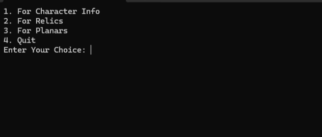

# starrail-wiki-scraper
A simple python scraper to automate data collection on the Star Rail wiki. All character and set data is collected from https://honkai-star-rail.fandom.com/wiki/Honkai:_Star_Rail_Wiki and stored as a CSV file.

## There are two ways to run this program

### First Method (No Python Required):

1. Locate the scraper folder, and run the **starrail_scraper.exe**.
2. A terminal should open up as shown below, where you can select the data you want to collect.

3. Once finished, you may either enter 4 to exit or exit the terminal.

### Second Method:

1. Ensure you have python and the necessary python packages installed, these being **requests** and **BeautifulSoup4**.
2. Run the **main.py** file, which will open up a terminal and show the exact same image as the one above.
3. Once finished you may either enter 4 or exit the terminal.